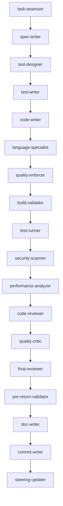

# Orchestrate - Complete Development Workflow with Strict Quality Enforcement

The ultimate development command that ensures PERFECT code quality through comprehensive agent orchestration.

## Usage
```
/orchestrate [task description]
```

## MANDATORY Quality Standards

**ZERO TOLERANCE POLICY:**
- **NO** compile errors or warnings
- **NO** unwrap() or panic!() in Rust
- **NO** placeholders or TODOs
- **NO** mock implementations
- **NO** incomplete functions
- **NO** missing error handling
- **NO** untested code
- **NO** undocumented APIs

## Execution Pipeline

### Phase 1: Requirements Analysis
```yaml
Agents:
  - task-assessor: Analyzes task requirements
  - spec-writer: Creates detailed specification
Actions:
  - Parse requirements
  - Identify affected components
  - Define success criteria
  - Create implementation plan
```

### Phase 2: Test-Driven Development
```yaml
Agents:
  - test-designer: Designs test strategy
  - test-writer: Writes comprehensive tests
Actions:
  - Write unit tests FIRST
  - Create integration tests
  - Add property tests
  - Define coverage targets
```

### Phase 3: Implementation
```yaml
Agents:
  - code-writer: Implements solution
  - rust-specialist/python-specialist: Language-specific patterns
Actions:
  - Write production code
  - Implement error handling
  - Add logging and metrics
  - Create documentation
```

### Phase 4: Quality Validation (MANDATORY)
```yaml
Agents:
  - quality-enforcer: Overall quality check (VETO POWER)
  - build-validator: Compilation verification (VETO POWER)
  - test-runner: Test execution (VETO POWER)
  - security-scanner: Security audit
  - performance-analyzer: Performance check
Actions:
  - Verify zero compile errors/warnings
  - Run all tests (100% pass required)
  - Check coverage (≥80% required)
  - Scan for vulnerabilities
  - Validate performance
```

### Phase 5: Code Review
```yaml
Agents:
  - code-reviewer: Implementation review
  - quality-critic: Quality assessment
  - final-reviewer: Comprehensive review
Actions:
  - Review architecture
  - Check best practices
  - Verify conventions
  - Assess maintainability
```

### Phase 6: Final Validation (MANDATORY)
```yaml
Agents:
  - pre-return-validator: Final checkpoint (ABSOLUTE VETO)
Actions:
  - Final compilation check
  - Final test run
  - Final quality scan
  - Block if ANY issue found
```

### Phase 7: Documentation & Commit
```yaml
Agents:
  - doc-writer: Documentation creation
  - commit-writer: Commit message generation
  - steering-updater: Update project context
Actions:
  - Generate/update documentation
  - Create conventional commit
  - Update STEER.md
  - Archive decisions
```

## Agent Invocation Order



## Quality Gates (Cannot Be Bypassed)

### Gate 1: Build Validation
```bash
cargo build --all-features  # Must show: 0 errors, 0 warnings
# Touch lib.rs or main.rs to force recompilation for clippy
if [ -f "src/lib.rs" ]; then touch src/lib.rs; elif [ -f "src/main.rs" ]; then touch src/main.rs; fi
cargo clippy -- -D warnings  # Must pass completely
```

### Gate 2: Test Validation
```bash
cargo test --all-features   # Must show: all tests passed
# Coverage must be ≥80%
```

### Gate 3: Security Validation
```bash
cargo audit                 # Must show: 0 vulnerabilities
bandit -r .                # Must show: no issues
```

### Gate 4: Final Validation
```bash
# Pre-return validator runs comprehensive checks
# ANY issue = VETO (no exceptions)
```

## Language-Specific Requirements

### Rust
```rust
// MANDATORY patterns:
use std::error::Error;
use anyhow::{Result, Context};

// FORBIDDEN patterns:
.unwrap()    // Use .context()? instead
.expect()    // Use .ok_or()? instead
panic!()     // Return Err() instead
todo!()      // Complete implementation
```

### Python
```python
# MANDATORY patterns:
from typing import Optional, Union, List, Dict
import logging

# FORBIDDEN patterns:
pass  # TODO    # Complete implementation
print()         # Use logging instead
except:         # Use specific exceptions
```

### TypeScript
```typescript
// MANDATORY patterns:
interface Props { }
type State = { }

// FORBIDDEN patterns:
any            // Use proper types
@ts-ignore     // Fix the issue
console.log    // Use proper logging
```

## Smart Context Management

```yaml
Token Management:
  - Monitor usage: /cost
  - Clear if needed: /clear
  - Load selectively
  - Unload after phases
  
File Management:
  - Load only affected files
  - Use .claudeignore
  - Archive completed work
  - Keep focus narrow
```

## Example Workflows

### Feature Implementation
```bash
/orchestrate "Implement retry logic with exponential backoff for network requests"
# Will: Write tests → Implement → Validate → Review → Document → Commit
```

### Bug Fix
```bash
/orchestrate "Fix memory leak in WebSocket connection handler"
# Will: Analyze → Test reproduction → Fix → Validate → Verify → Commit
```

### Refactoring
```bash
/orchestrate "Refactor database module to use async/await pattern"
# Will: Plan → Test coverage → Refactor → Validate → Benchmark → Commit
```

### Performance Optimization
```bash
/orchestrate "Optimize query performance for user search endpoint"
# Will: Profile → Identify → Optimize → Benchmark → Validate → Commit
```

## Success Criteria Checklist

Before completion, ALL must be checked:
- [ ] Zero compilation errors
- [ ] Zero compilation warnings
- [ ] All tests passing (100%)
- [ ] Code coverage ≥80%
- [ ] Zero security vulnerabilities
- [ ] No performance regressions
- [ ] No unwrap/panic in code
- [ ] No placeholders/TODOs
- [ ] All APIs documented
- [ ] Commit message ready
- [ ] STEER.md updated

## Failure Recovery

If validation fails:
```bash
# Check what failed
/status

# Fix specific issues
/fix-unwraps        # Remove unwrap() calls
/fix-errors         # Fix compile errors
/fix-tests          # Fix failing tests

# Re-run validation
/orchestrate --validate-only

# If still failing, get help
/debug --verbose
```

## Emergency Commands

```bash
/abort              # Stop current orchestration
/rollback           # Revert changes
/cost               # Check token usage
/clear              # Clear context
/status             # Check current state
/debug              # Debug mode
```

## Performance Targets

- Compilation: <30 seconds
- Test suite: <2 minutes
- Full validation: <5 minutes
- Token usage: <100k per task

## Remember

**Quality is MANDATORY, not optional. Every piece of code must be:**
- Compilable without warnings
- Fully tested with good coverage
- Properly documented
- Security validated
- Performance verified
- Ready for production

**The pre-return-validator has ABSOLUTE VETO POWER. No code leaves without passing ALL checks.**

This is engineering excellence, not compromise!
