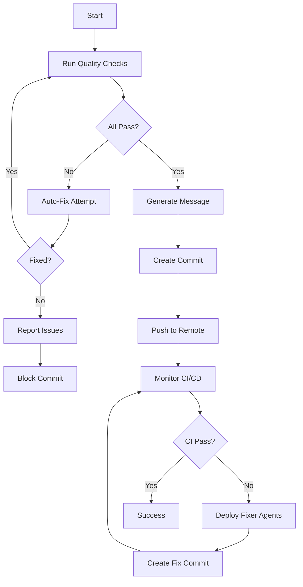

# Ultra Commit Command - Zero-Tolerance Quality Commit System

Intelligent commit system that ENSURES all quality standards are met before committing. Never commits broken code.

## Usage

```bash
/ultra-commit                    # Auto-generates message from changes
/ultra-commit "custom message"   # Use custom commit message
/ultra-commit --fix              # Auto-fix issues and retry
/ultra-commit --force-check      # Re-run all checks even if cached
```

## Core Philosophy

**NO COMMIT until ALL quality gates pass. Period.**

## Quality Gates (ALL MUST PASS)

### 1. Code Formatting ✅
- Rust: `cargo fmt --all`
- Python: `ruff format .`
- TypeScript: `prettier --write .`
- Go: `gofmt -w .`

### 2. Compilation ✅
- Zero errors
- Zero warnings
- Clean build required

### 3. Linting ✅
- Rust: `cargo clippy -- -D warnings`
- Python: `ruff check .`
- TypeScript: `eslint . --max-warnings 0`

### 4. Forbidden Patterns ✅
- NO `.unwrap()` or `.expect()` in production Rust
- NO `panic!()`, `todo!()`, `unimplemented!()`
- NO `console.log` in production JS/TS
- NO `print()` in production Python
- NO placeholders or mock implementations

### 5. Tests ✅
- 100% test pass rate
- Minimum 85% coverage
- No skipped tests
- No ignored tests

### 6. Security ✅
- No known vulnerabilities
- Dependencies audited
- No hardcoded secrets

### 7. Documentation ✅
- All public APIs documented
- README up to date
- Examples provided

## Execution Flow



## Agent Orchestration

### Pre-Commit Agents
1. **format-agent** - Auto-formats all code
2. **lint-agent** - Fixes linting issues
3. **test-guardian** - Ensures tests pass
4. **security-scanner** - Security validation
5. **documentation-auditor** - Docs check

### Commit Agents
1. **commit-writer** - Intelligent message generation
2. **commit-validator** - Message standards

### Post-Commit Agents
1. **workflow-monitor** - CI/CD monitoring
2. **workflow-fixer** - Auto-fix CI failures
3. **test-fixer** - Fix failing tests
4. **dependency-fixer** - Resolve dependencies

## Quality Enforcement

### Rust Projects
```bash
# MANDATORY checks
cargo fmt --all
# Touch lib.rs or main.rs to force recompilation for clippy
if [ -f "src/lib.rs" ]; then touch src/lib.rs; elif [ -f "src/main.rs" ]; then touch src/main.rs; fi
cargo clippy --all-features -- -D warnings
RUSTFLAGS="-D warnings" cargo build --release
cargo test --all
cargo audit

# Forbidden pattern scan
find src -name "*.rs" -type f | xargs grep -l "\.unwrap()\|\.expect(\|panic!(" | grep -v test
```

### Python Projects
```bash
# MANDATORY checks
ruff format .
ruff check . --fix
mypy . --strict
pytest --cov=. --cov-fail-under=85
bandit -r .
safety check
```

### TypeScript Projects
```bash
# MANDATORY checks
prettier --write .
eslint . --fix --max-warnings 0
tsc --noEmit --strict
npm test
npm audit --audit-level=moderate
```

## Auto-Fix Strategy

When issues are detected:

1. **Formatting Issues** → Auto-format and retry
2. **Linting Issues** → Auto-fix with --fix flags
3. **Import Issues** → Auto-organize imports
4. **Test Failures** → Delegate to test-fixer agent
5. **Build Errors** → Delegate to code-fixer agent
6. **Documentation** → Auto-generate missing docs

## Retry Logic

```yaml
Max Attempts: 5
Retry Delay: Progressive (2s, 5s, 10s, 20s, 30s)
Fix Strategy: 
  - Attempt 1-2: Auto-fix with tools
  - Attempt 3-4: Delegate to specialist agents
  - Attempt 5: Deep analysis with master-orchestrator
Failure Action: Block commit and provide detailed report
```

## Commit Message Generation

### Automatic Analysis
- Analyzes all changes
- Groups by type (feat, fix, refactor, etc.)
- Includes scope detection
- Adds breaking change notices
- References issues/PRs

### Format
```
<type>(<scope>): <subject>

<body>

<footer>
```

### Examples
```
feat(auth): implement OAuth2 integration

- Added OAuth2 provider support
- Implemented token refresh logic
- Added user profile sync
- Updated authentication middleware

BREAKING CHANGE: Auth API endpoints changed
Closes #123
```

## CI/CD Monitoring

After successful commit:

1. **Track Workflows** - Monitor all GitHub Actions
2. **Detect Failures** - Identify failure patterns
3. **Auto-Fix** - Deploy appropriate fixer agents
4. **Verify** - Ensure all workflows pass
5. **Report** - Provide status updates

## Success Criteria

Commit ONLY happens when:
- ✅ All formatting correct
- ✅ Zero compilation errors/warnings
- ✅ Zero linting issues
- ✅ No forbidden patterns
- ✅ 100% tests passing
- ✅ Coverage > 85%
- ✅ Security scan clean
- ✅ Documentation complete

## Failure Reporting

When commit is blocked:

```
❌ COMMIT BLOCKED - Quality Issues Detected
━━━━━━━━━━━━━━━━━━━━━━━━━━━━━━━━━━━━━━━━━
Issues Found: 3

1. Clippy Warnings (2)
   - src/main.rs:45 - use of unwrap()
   - src/lib.rs:120 - unnecessary clone()
   
2. Test Failures (1)
   - test_auth_flow failed
   
3. Documentation Missing
   - Public function 'process_data' undocumented

━━━━━━━━━━━━━━━━━━━━━━━━━━━━━━━━━━━━━━━━━
Auto-Fix Available: YES
Run: /ultra-commit --fix
```

## Integration with Hooks

Works with these hooks:
- `auto-format.sh` - Post-edit formatting
- `pre-commit-check.sh` - Pre-commit validation
- `notify.py` - Status notifications

## Command Options

### --fix
Attempts automatic fixes for all issues:
```bash
/ultra-commit --fix
```

### --force-check
Bypasses cache and runs all checks:
```bash
/ultra-commit --force-check
```

### --dry-run
Shows what would be committed without committing:
```bash
/ultra-commit --dry-run
```

### --amend
Amends the previous commit:
```bash
/ultra-commit --amend
```

## Emergency Override

**NEVER USE** unless absolutely necessary:
```bash
/ultra-commit --emergency-override "REASON"
```
This creates an audit log and notifies team.

## Best Practices

1. **Always use /ultra-commit** instead of manual git commands
2. **Let auto-fix run** before manual intervention
3. **Review CI/CD results** after push
4. **Document breaking changes** in commit message
5. **Reference issues** in footer

## Status Indicators

```
🔍 Checking...      - Running quality checks
🔧 Fixing...        - Auto-fixing issues
✅ Passed          - Check successful
❌ Failed          - Check failed
⏳ Retrying...     - Retry in progress
📤 Pushing...      - Pushing to remote
👀 Monitoring...   - Watching CI/CD
🎉 Success!        - All complete
```

## Remember

**Quality is non-negotiable. This command ensures PERFECT commits every time.**

No shortcuts. No compromises. Only excellence.