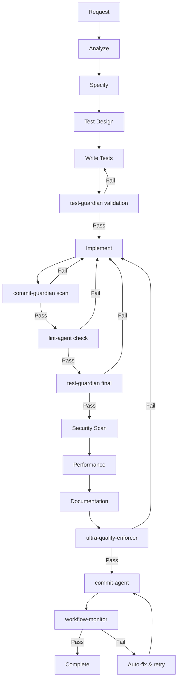

# Ultra Quality Development Command - ENHANCED v2.0

Executes a complete development workflow with ABSOLUTE ZERO-TOLERANCE quality enforcement. This enhanced version ensures ALL code is committed, ALL tests pass, and ZERO placeholders exist.

## Usage

Type `/ultra-dev` followed by your task description.

## What It Does

1. **Analyzes your request** using the master-orchestrator
2. **Creates specifications** with proper documentation
3. **Writes tests first** (TDD approach) with test-guardian validation
4. **Implements solution** with zero defects
5. **Validates EVERYTHING** through guardian agents
6. **Fixes ALL issues** automatically with retry logic
7. **Commits ALL code** using commit-agent
8. **Monitors CI/CD** until all workflows pass
9. **Final approval** from ultra-quality-enforcer

## Quality Standards Enforced (ZERO TOLERANCE)

### ❌ ABSOLUTELY FORBIDDEN
- ANY compilation errors or warnings
- ANY unwrap(), expect(), panic!() in production
- ANY todo!(), unimplemented!(), or placeholders
- ANY failing tests (100% MUST pass)
- ANY skipped or ignored tests
- ANY code not committed
- ANY linting issues
- ANY formatting issues
- ANY type errors
- ANY console.log or print statements

### ✅ GUARANTEED OUTCOMES
- 100% test pass rate (enforced by test-guardian)
- Zero placeholders (enforced by commit-guardian)
- All code committed (enforced by commit-agent)
- Minimum 85% code coverage
- Perfect formatting and linting
- Complete documentation
- Security vulnerability free
- Performance optimized
- CI/CD workflows passing

## Example

```
/ultra-dev Create a robust error handling system for file operations with retry logic
```

## Enhanced Workflow with Guardian Gates



## Enhanced Agent Orchestra

### Primary Orchestration
1. **master-orchestrator** - Coordinates everything with retry logic

### Specification & Design
2. **spec-writer** - Creates complete specifications
3. **test-designer** - Designs comprehensive test strategy

### Implementation
4. **test-writer** - Writes tests with 100% coverage goal
5. **code-writer** - Implements with ZERO placeholders

### Guardian Gates (NEW - ENFORCED)
6. **test-guardian** - Ensures 100% test pass rate
7. **commit-guardian** - Scans for forbidden patterns
8. **lint-agent** - Zero warnings tolerance

### Quality Validation
9. **quality-enforcer** - Pre-validation checks
10. **security-scanner** - Security audit
11. **performance-analyzer** - Performance optimization
12. **documentation-auditor** - Documentation completeness

### Final Gates
13. **ultra-quality-enforcer** - Ultimate quality gate
14. **commit-agent** - Ensures ALL code committed
15. **workflow-monitor** - CI/CD monitoring until pass

## Enhanced Quality Gates with Guardian Enforcement

Each gate has a GUARDIAN that BLOCKS progress until perfect:

| Gate | Guardian | Requirement | Standard | Retry |
|------|----------|-------------|----------|-------|
| Forbidden Patterns | commit-guardian | NO unwrap/panic/todo | 100% | ∞ |
| Test Pass Rate | test-guardian | ALL tests pass | 100% | ∞ |
| Test Coverage | test-guardian | Code coverage | >85% | ∞ |
| Linting | lint-agent | Zero warnings | 100% | ∞ |
| Formatting | commit-guardian | Perfect format | 100% | Auto |
| Compilation | commit-guardian | Zero errors/warnings | 100% | ∞ |
| Security | security-scanner | No vulnerabilities | 100% | ∞ |
| Performance | performance-analyzer | Meets targets | 100% | 3x |
| Documentation | documentation-auditor | Complete | 100% | 3x |
| Commit | commit-agent | ALL code committed | 100% | ∞ |
| CI/CD | workflow-monitor | ALL workflows pass | 100% | 10x |

## Enhanced Automatic Actions with Retry Logic

### Automatic Fixes (Infinite Retry)
- **Formatting** - Auto-formats with cargo fmt, ruff, prettier
- **Linting** - Auto-fixes with clippy --fix, ruff --fix, eslint --fix
- **Imports** - Auto-organizes and removes unused
- **Simple errors** - Auto-corrects obvious issues

### Delegated Fixes (Up to 10 Retries)
- **Test failures** - Delegates to test-fixer with context
- **Compilation errors** - Delegates to code-fixer
- **Type errors** - Delegates to language specialists
- **Coverage gaps** - Delegates to test-writer
- **Documentation** - Delegates to docs-updater

### Pattern Replacement (MANDATORY)
- **unwrap() → ok_or()?** - Automatic replacement
- **expect() → proper error** - Automatic replacement
- **panic!() → Result** - Automatic replacement
- **todo!() → implementation** - Delegates to code-writer
- **print() → logging** - Automatic replacement

### Commit Enforcement (NEW)
- **ALL changed files** - Automatically staged
- **Intelligent messages** - Generated by commit-writer
- **Push to remote** - Automatic with tracking
- **CI/CD monitoring** - Continues until green

## Enhanced Failure Handling with Guardian Intervention

### Stage 1: Automatic Fix (Immediate)
```bash
# Guardian agents attempt automatic fixes
if FORMATTING_ISSUE:
    cargo fmt --all && ruff format . && prettier --write .
    
if LINT_WARNING:
    # Touch lib.rs or main.rs to force recompilation for clippy
    if [ -f "src/lib.rs" ]; then touch src/lib.rs; elif [ -f "src/main.rs" ]; then touch src/main.rs; fi
    cargo clippy --fix && ruff --fix && eslint --fix
    
if IMPORT_ISSUE:
    isort . && cargo fix
```

### Stage 2: Specialist Delegation (Smart Retry)
```bash
# Delegates to specialist agents with context
if TEST_FAILURE:
    DELEGATE → test-fixer (with failure details)
    RETRY_COUNT = 0
    while RETRY_COUNT < 10:
        if test-fixer.fix():
            break
        RETRY_COUNT++
        BACKOFF = 2^RETRY_COUNT seconds
        
if FORBIDDEN_PATTERN:
    DELEGATE → rust-specialist or python-specialist
    ENFORCE zero-tolerance replacement
```

### Stage 3: Escalation Protocol
```bash
# If retries exhausted
if RETRIES_EXHAUSTED:
    1. Save state to .ultra-dev-state.json
    2. Generate detailed failure report
    3. Create fix checklist
    4. Notify user with specific actions
    5. Resume capability with --resume flag
```

### Stage 4: CI/CD Recovery
```bash
# After commit, monitor and fix CI/CD
if WORKFLOW_FAILURE:
    DELEGATE → workflow-monitor
    workflow-monitor:
        - Identifies failure type
        - Delegates to appropriate fixer
        - Creates fix commit
        - Monitors until green
```

## Enhanced Success Criteria (ALL MANDATORY)

### Code Quality ✅
- [ ] ZERO compilation errors or warnings
- [ ] ZERO forbidden patterns (unwrap, panic, todo)
- [ ] ZERO linting issues
- [ ] ZERO type errors
- [ ] Perfect formatting

### Testing ✅
- [ ] 100% test pass rate (test-guardian verified)
- [ ] ZERO skipped or ignored tests
- [ ] Minimum 85% code coverage
- [ ] All edge cases tested

### Documentation ✅
- [ ] All public APIs documented
- [ ] README updated if needed
- [ ] Examples provided
- [ ] Changelog updated

### Commit & CI/CD ✅
- [ ] ALL code committed (commit-agent verified)
- [ ] Meaningful commit messages
- [ ] Code pushed to remote
- [ ] ALL CI/CD workflows passing
- [ ] No pipeline failures

### Final Validation ✅
- [ ] ultra-quality-enforcer approved
- [ ] All guardian agents satisfied
- [ ] Zero technical debt
- [ ] Production-ready code

## Implementation Script

```bash
#!/bin/bash
# Ultra-Dev Enhanced Implementation

set -euo pipefail

# State management
STATE_FILE=".ultra-dev-state.json"
RETRY_COUNT=0
MAX_RETRIES=10

# Initialize state
initialize_state() {
    echo '{"stage": "init", "retries": 0, "issues": []}' > "$STATE_FILE"
}

# Save state for recovery
save_state() {
    local stage="$1"
    jq ".stage = \"$stage\" | .retries = $RETRY_COUNT" "$STATE_FILE" > temp.json
    mv temp.json "$STATE_FILE"
}

# Main execution flow
execute_ultra_dev() {
    local task="$1"
    
    echo "🚀 ULTRA-DEV v2.0 - ZERO TOLERANCE MODE"
    echo "═══════════════════════════════════════"
    
    # Stage 1: Specification
    echo "📋 Stage 1: Creating specifications..."
    claude-code run master-orchestrator --task "$task" --mode spec
    claude-code run spec-writer --task "$task"
    
    # Stage 2: Test Design (TDD)
    echo "🧪 Stage 2: Designing tests..."
    claude-code run test-designer --task "$task"
    claude-code run test-writer --task "$task" --coverage-target 85
    
    # Stage 3: Test Validation (CRITICAL)
    echo "🛡️ Stage 3: Test Guardian validation..."
    while ! claude-code run test-guardian; do
        echo "❌ Test validation failed - fixing..."
        claude-code run test-fixer --auto
        ((RETRY_COUNT++))
        if [ $RETRY_COUNT -ge $MAX_RETRIES ]; then
            echo "❌ Max retries reached for test validation"
            save_state "test-validation"
            exit 1
        fi
    done
    
    # Stage 4: Implementation
    echo "💻 Stage 4: Implementing solution..."
    claude-code run code-writer --task "$task" --no-placeholders
    
    # Stage 5: Guardian Gates (CRITICAL)
    echo "🛡️ Stage 5: Guardian validation..."
    
    # Commit Guardian - Forbidden patterns
    while ! claude-code run commit-guardian; do
        echo "❌ Forbidden patterns detected - fixing..."
        claude-code run rust-specialist --fix
        claude-code run python-specialist --fix
        ((RETRY_COUNT++))
        if [ $RETRY_COUNT -ge $MAX_RETRIES ]; then
            echo "❌ Cannot eliminate forbidden patterns"
            save_state "commit-guardian"
            exit 1
        fi
    done
    
    # Lint Agent - Zero warnings
    while ! claude-code run lint-agent --strict; do
        echo "❌ Linting issues - auto-fixing..."
        claude-code run lint-agent --fix
    done
    
    # Test Guardian - 100% pass rate
    while ! claude-code run test-guardian --strict; do
        echo "❌ Test failures - delegating to test-fixer..."
        claude-code run test-fixer --context "ultra-dev"
    done
    
    # Stage 6: Quality Validation
    echo "✅ Stage 6: Quality validation..."
    claude-code run security-scanner
    claude-code run performance-analyzer
    claude-code run documentation-auditor
    
    # Stage 7: Ultra Quality Enforcer (FINAL GATE)
    echo "🎯 Stage 7: Ultra quality enforcement..."
    while ! claude-code run ultra-quality-enforcer --strict; do
        echo "❌ Quality gate failed - fixing issues..."
        # Ultra-quality-enforcer delegates to guardians
        sleep 2
    done
    
    # Stage 8: Commit (MANDATORY)
    echo "📦 Stage 8: Committing all code..."
    claude-code run commit-agent --message "feat: $task (ultra-dev)"
    
    # Stage 9: CI/CD Monitoring
    echo "🔄 Stage 9: Monitoring CI/CD..."
    claude-code run workflow-monitor --until-green
    
    # Success!
    echo ""
    echo "✅ ULTRA-DEV COMPLETE - PERFECT QUALITY"
    echo "═══════════════════════════════════════"
    echo "Task: $task"
    echo "Quality: 100%"
    echo "Tests: 100% passing"
    echo "Coverage: >85%"
    echo "Commit: Complete"
    echo "CI/CD: All green"
    echo "═══════════════════════════════════════"
    
    # Cleanup
    rm -f "$STATE_FILE"
}

# Resume from saved state
resume_ultra_dev() {
    if [ ! -f "$STATE_FILE" ]; then
        echo "❌ No saved state found"
        exit 1
    fi
    
    local stage=$(jq -r '.stage' "$STATE_FILE")
    RETRY_COUNT=$(jq -r '.retries' "$STATE_FILE")
    
    echo "📂 Resuming from stage: $stage"
    echo "Retry count: $RETRY_COUNT"
    
    # Resume from the failed stage
    case $stage in
        test-validation)
            execute_ultra_dev "" # Resume with empty task
            ;;
        commit-guardian)
            execute_ultra_dev ""
            ;;
        *)
            echo "❌ Unknown stage: $stage"
            exit 1
            ;;
    esac
}

# Main entry point
if [ "${1:-}" = "--resume" ]; then
    resume_ultra_dev
else
    initialize_state
    execute_ultra_dev "$*"
fi
```

---

## Key Improvements in v2.0

### 1. Guardian Integration
- **test-guardian** ensures 100% test pass rate
- **commit-guardian** blocks forbidden patterns
- **lint-agent** enforces zero warnings

### 2. Commit Enforcement
- **commit-agent** automatically commits ALL code
- Intelligent commit messages
- Push to remote with tracking

### 3. CI/CD Monitoring
- **workflow-monitor** watches until green
- Automatic failure fixing
- Up to 10 retry attempts

### 4. State Preservation
- Saves progress on failure
- Resume capability with --resume
- No lost work

### 5. Zero Placeholder Guarantee
- Forbidden pattern scanning
- Automatic replacement
- Specialist delegation for complex fixes

---

**Remember**: Ultra-Dev v2.0 is your GUARANTEE of perfect code. It will NOT complete until:
- ALL tests pass
- ZERO placeholders exist
- ALL code is committed
- CI/CD is green

No compromises. No shortcuts. Only perfection.